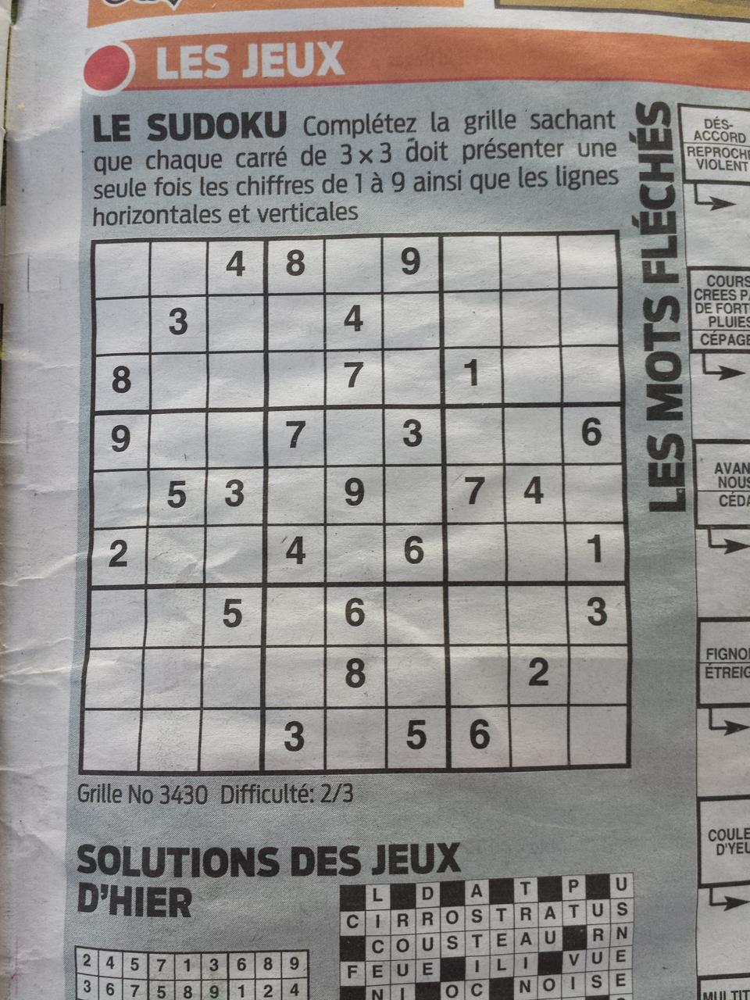
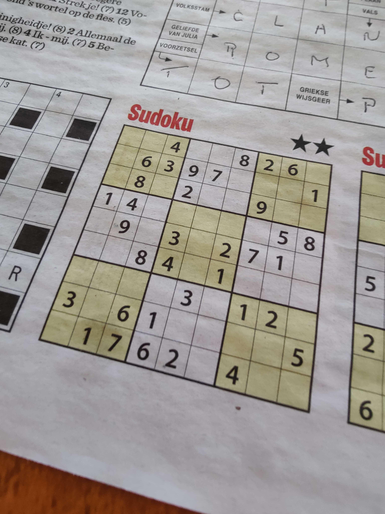
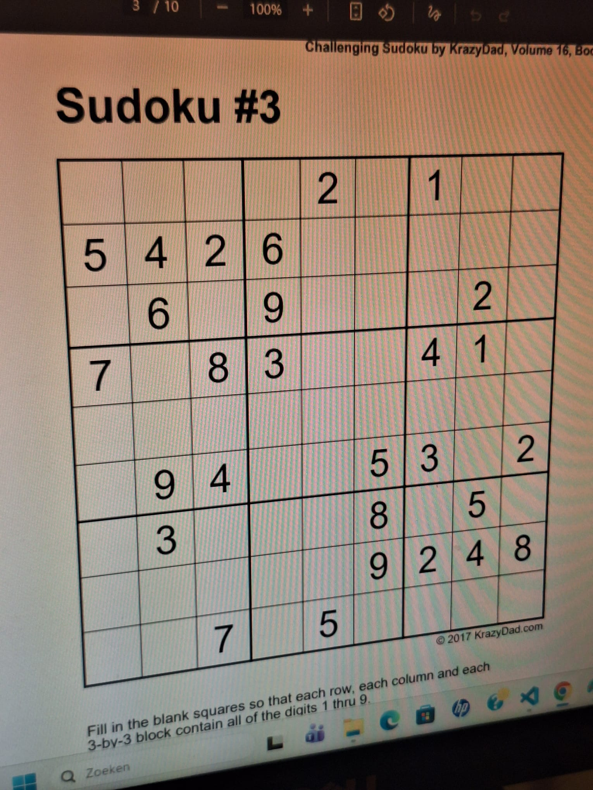

# Sudoku Solver

**Solve real Sudoku puzzles from images**

Sudoku Vision Solver is an image-based puzzle-solving application that allows users to upload a photo of a Sudoku puzzle. The app detects the Sudoku grid, extracts the existing numbers, solves the puzzle, and overlays the completed solution onto a perspective warped image of the original photo.

1. The user uploads or captures a picture of a Sudoku puzzle.
2. The app detects the Sudoku grid in the image.
3. The existing digits are extracted from the puzzle.
4. The Sudoku is solved algorithmically.
5. The missing numbers are drawn back onto a perspective warped image.

## Live Demo
[Try the app here](https://sudoku-solver-frontend-wui7.onrender.com/)

## About This Project

The goal was to create a practical tool that can take a real-world Sudoku puzzle from an image, detect the grid, extract the given numbers, solve the puzzle, and overlay the completed solution back onto the image in a convenient way.

This project allowed me to combine a practical personal use case with technical challenges such as image processing, digit recognition, Sudoku-solving algorithms, and visual result overlay.

## Accepted Photos

To get the most accurate result, please upload a clear photo of a Sudoku puzzle.

- Full Sudoku grid is visible
- Puzzle is printed clearly
- Image is sharp and not blurry
- Good lighting
- Minimal shadows

Some example include: 

  
  
  

## What I Learned

While building this project, I improved my skills in:

- Building image-based web applications
- Handling user-uploaded images
- Processing images for computer vision tasks
- Detecting Sudoku grids from real-world images
- Using OCR or digit-recognition techniques
- Structuring logic into reusable services and components

## Future Improvements

- Add support for handwritten Sudoku puzzles
- Allow users to manually correct detected digits before solving
- Add step-by-step solving explanations
- Add mobile camera capture

